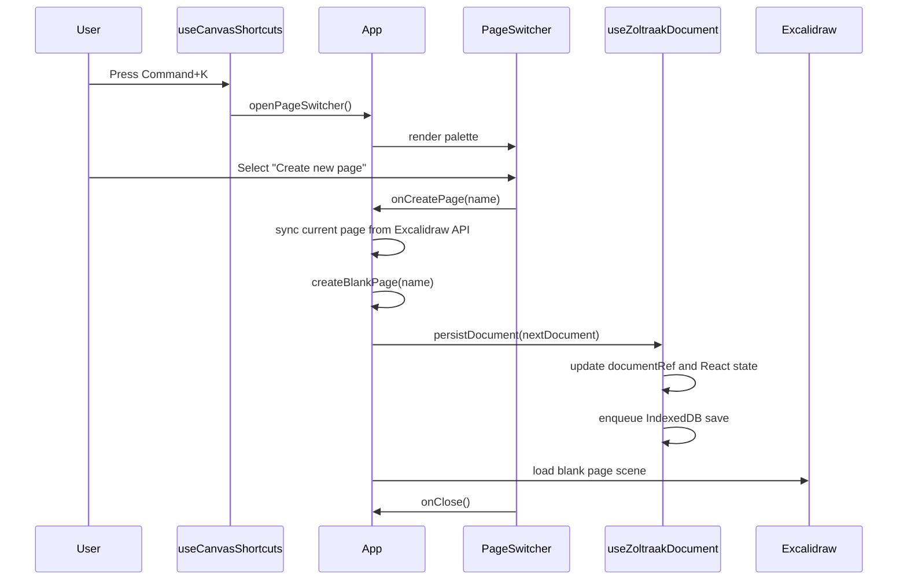

# T2 Page Switcher

T2 adds a lightweight command palette for creating and switching between Excalidraw-backed pages. The user-facing behavior stays small: `Command+K` opens the palette, search filters pages, Enter switches to the highlighted page, and the create option adds a new blank page.

## Command+K New Page Flow

`Command+K` is handled in `useCanvasShortcuts` during the keyboard capture phase. That matters because Excalidraw can own focused editor content; capture-phase handling lets the app open the page switcher before focused editor content stops the event.



## Hook Responsibilities

`useCanvasShortcuts` owns keyboard behavior:

- `Command+K` opens the page switcher through `onOpenPageSwitcher`.
- `r` sets the active Excalidraw tool to rectangle.
- `a` sets the active Excalidraw tool to arrow.
- Text inputs, editable content, and modified drawing shortcuts are ignored where appropriate so typing still behaves normally.

`useZoltraakDocument` owns document lifecycle and persistence:

- `document` is the React state used for rendering.
- `documentRef` mirrors the latest document for event handlers and Excalidraw callbacks that should not close over stale state.
- `persistDocument(nextDocument)` updates both `documentRef` and React state, then queues an IndexedDB save through `SaveQueue`.
- `resetDocument()` creates a fresh default document and writes it through the same save queue used by normal autosaves.
- `updatePageScene(pageId, elements, appState, files)` writes the latest Excalidraw scene into the requested page and persists the updated document.
- Initial load calls `loadDocument()` and falls back to `createDefaultDocument()` if storage is unavailable.

`SaveQueue` serializes writes so saves happen in order. If one save fails, the queue reports and absorbs the failure so later saves still run.

## Stored Document Shape

All pages live in a single IndexedDB document:

- database: `zoltraak`
- object store: `documents`
- key: `zoltraak-canvas`

The stored value is a `ZoltraakDocument`:

```ts
type ZoltraakDocument = {
	schemaVersion: 1
	currentPageId: string
	pages: ZoltraakPage[]
}

type ZoltraakPage = {
	id: string
	name: string
	elements: readonly ExcalidrawElement[]
	appState: StoredAppState
	files: BinaryFiles
}
```

When a new page is created, `createBlankPage(name)` creates:

- a generated `id`
- the requested `name`
- an empty `elements` array
- an `appState` with `viewBackgroundColor: '#ffffff'`
- an empty `files` object

`App.createPage()` first snapshots the current Excalidraw scene into the active page with `sceneFromApi()`. It then appends the new blank page, sets `currentPageId` to the new page id, persists the full document, and calls `loadPageIntoApi()` so Excalidraw displays the new page immediately.

Switching pages follows the same safety pattern: snapshot the current page first, update `currentPageId`, persist the document, then load the target page's stored `elements`, serialized `appState`, and `files` into Excalidraw.
